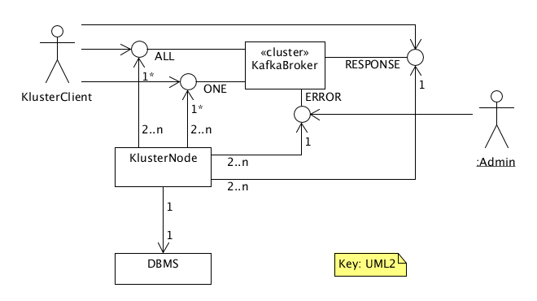
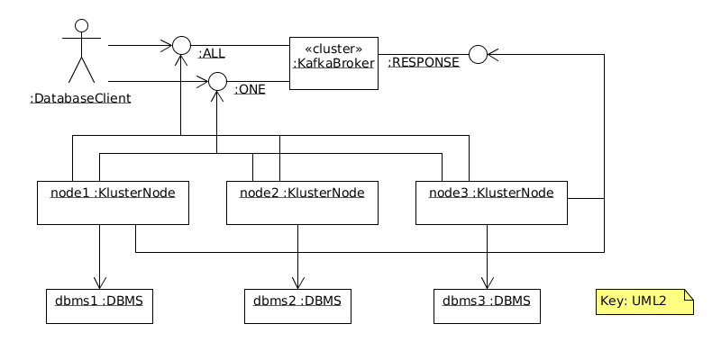
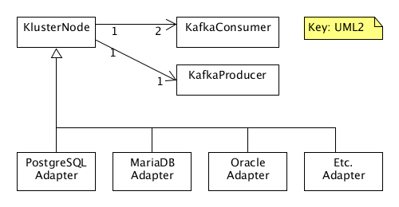

# Kluster

Cluster of N SQL-DBMS instances kept in sync using Kafka __consistently__. So no need for eventual-consisteny! The price for
the consistenty is asynchronicity.

You can use any type of DBMS (PostgreSQL, Oracle, MariaDB, etc.). In fact you can even mix them in the same cluster:
some nodes are PostgreSQL, some are Oracle, etc.

Traditionally DBMSes support clustering each in their own way. They use master-slave nodes, active-active or active-passive modes, etc.
All these approaches are different for each DBMS vendor. Kluster provides a way to cluster a set of DBMS nodes of in a
vendor independant way.


## Design

Overview:  


Example with 3 nodes:  


Components:  


ALL topic: 1 partition, each node in its own consumer group.  
ONE topic: M >= 1 partitions, all nodes in the same consumer group.

Client writes its request to both topics.  
Each node reads it from ALL topic, and 1 reads it from the ONE topic.

Per node:
```
IF (CUD request) { // CUD = Create, Update or Delete, aka mutation aka write
    do mutation on local store
    IF (same request arrives from ONE topic within timeoutPeriod) {
        send processing response to RESPONSE topic
    }
} ELSE { // R request, R = Read
    IF (same request arrives from ONE topic within timeoutPeriod) {
        do query on local store
        send processing response to RESPONSE topic
    }
}
```

### Replication

All nodes read from the ALL topic, so they all process all CUD requests in right order.

NB. Kafka is clustered also, with multiple replicated instances for each partition.

### Load Balancing

Only 1 node processes an R request and writes its processing result to the RESPONSE topic.  
All nodes processes the CUD request, but only 1 node writes its processing result to RESPONSE topic.

NB. The ONE topic can be pafrtitioned, also giving some load balancing.

### Consistency

The client can wait for the response on RESPONSE topic to see if result indicates success or error.

### Backup

- Select a node.
- Stop its consumer.
- Create a snapshot backup of its database.
- Restart consumer.

### Recovery

A node had crashed and has been repaired, but its database is still empty. To bring it up again:

- First use the latest database backup to poplate it.
- Next set the ONE topic consumer offset to the point corresponding to the database backup: only the messages newer than the backup are to be read.
- Set ALL topic consumer offset to the head.

### Messages

#### Request
```
messageId: unique message id, generated by client, eg. a UUID
sqlString: SQL string to be executed
```

#### Response
```
messageId: unique message id, generated by node that handled the request, eg. a UUID
referenceId: the messageId of the corresponding request
result: JSON string containing the result of the operartion, in case of a query quite large for contains the entire result set
```

## Quickstart

 1. Compile the software and start a cluster. This is done using a Makefile and docker-compose.  
 
        make
 
 1. Run kluster-client-golang.go

        cd kluster-client-golang
        KAFKA_RESPONSE_TOPIC="kluster-mutation-response" KAFKA_BOOTSTRAP_SERVERS="localhost:9092" KAFKA_MUTATION_TOPIC="kluster-mutation-test" go run kluster-client-golang.go

 1. You should see something like 
 
        2017/10/28 13:34:32 [kafkaClient] sent query for execution with id 1509190472045: SELECT 2+2 as Count
        2017/10/28 13:34:32 [futureResult] Waiting sync for query 1509190472045 to return
        2017/10/28 13:34:32 [kafkaResultTracker] Received result message, key=1509190472045 val=Successfully executed query, rowsAffected=1 
        2017/10/28 13:34:32 [kafkaResultTracker] received result for query with id 1509190472045, completing result!
        2017/10/28 13:34:32 [kafkaResultTracker] Received result message, key=1509190472045 val=Successfully executed query, rowsAffected=1 
        2017/10/28 13:34:32 [kafkaResultTracker] received result for query with id 1509190472045, was query was already finished at 2017-10-28T13:34:32+02:00
        2017/10/28 13:34:32 [kafkaResultTracker] Received result message, key=1509190472045 val=Successfully executed query, rowsAffected=1 
        2017/10/28 13:34:32 [kafkaResultTracker] received result for query with id 1509190472045, was query was already finished at 2017-10-28T13:34:32+02:00

### Manual steps
You can also spin up a cluster manually:

```sh
docker run --name kluster-kafka -d -p 2181:2181 -p 9092:9092 --env ADVERTISED_HOST=localhost --env ADVERTISED_PORT=9092 --env TOPICS=kluster-mutation,kluster-response spotify/kafka
            
docker run --name kluster-postgres-1 -d -p 20001:5432 -e POSTGRES_USER=kluster -e POSTGRES_PASSWORD=kluster -d postgres
docker run --name kluster-postgres-2 -d -p 20002:5432 -e POSTGRES_USER=kluster -e POSTGRES_PASSWORD=kluster -d postgres
docker run --name kluster-postgres-3 -d -p 20003:5432 -e POSTGRES_USER=kluster -e POSTGRES_PASSWORD=kluster -d postgres

# start the adapters (see kluster/docker-compose.yml for config) 
# start the golang
```

All writes are published as queries on a Kafka topic with one partition. 
Daemons read from this topic, execute the queries and write the response to the
response topic, using a correlation ID provided.

TODO:

 - [X] create a postgres adapter that listens on a kafka topic for queries
 - [X] provide docker compose file that spins it all up.
 - [X] implement a client that listens on the response topic and requires at least 1 result.
 - [ ] marshall the result set as part of the response
 - [ ] read queries should be handled by only one pg instance
 - [ ] allow messages to be a set of statements forming a transaction
 - [ ] analyse the consequences of allowing multiple write partitions, but force each producer to produce to the same partition during it's runtime.
 - [ ] implement a JDBC driver 
 - [ ] implement a golang SQL driver
 