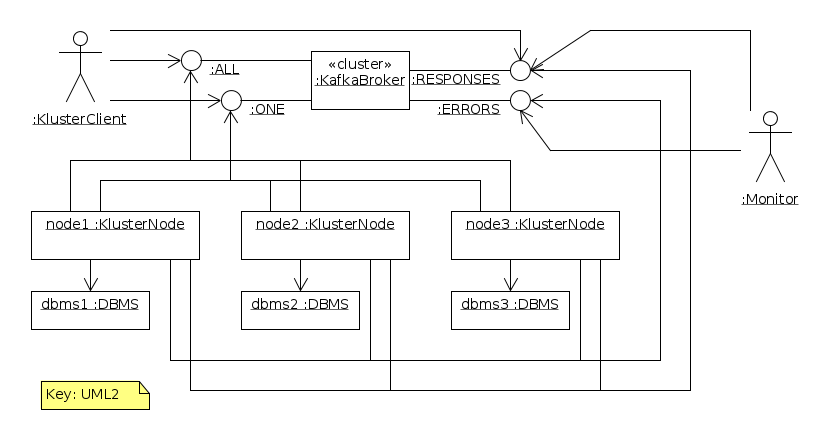

# Kluster

Cluster of N SQL-DBMS instances kept in sync __consistently__ using Kafka. So no need for eventual-consisteny! The price for
the consistenty is asynchronicity and no load balancing, only replication.

You can use any type of DBMS (PostgreSQL, Oracle, MariaDB, etc.). In fact one could even mix them in the same cluster, provided they speak the same SQL dialect:
some nodes are PostgreSQL, some are Oracle, etc. If they dont speak the same SQL dialect the database adapters should do some translations.
However, for now mixing database types is not supported. 

Traditionally DBMSes support clustering each in their own way. They use master-slave nodes, active-active or active-passive modes, etc.
All these approaches are different for each DBMS vendor. Kluster provides a way to cluster a set of DBMS nodes of in a
vendor independant way.


## Design

Overview:  


Example with 3 nodes:  


Components:  


ALL topic: 1 partition, each node in its own consumer group, ie. ALL receive these message.  
ONE topic: M >= 1 partitions, all nodes in the same consumer group, ie. only ONE node receives each message.

Client writes its request to both topics.  
Each node reads it from ALL topic (because each has its own consumer group), and only 1 reads it from the ONE topic (because they share a consumer group).

Each node continuously reads request messages from the ALL and ONE topic asynchronously. Each messages is handed like this:
```
FOR EACH (request received) {
    delete all expired messages from message buffer // expired == now > message.timeStamp + message.timeoutPeriod
    IF (read request) && (request is expired) {
        commit topic offset
        CONTINUE
    }  
    IF (request is from ALL topic) {
        execute request
        IF (request already in buffer) {
            send result to RESPONSE topic
            delete request from buffer
        } ELSE {
            add request and result to buffer
        }
    } ELSE { // request is from ONE topic
        IF (read request) && (!request.strictOrder) {
            execute request
            send result to RESPONSE topic
        } ELSE IF (request already in buffer) {
            send result from buffer to RESPONSE topic
            delete request from buffer
        } ELSE {
            add request to buffer
        }
    }
    commit topic offset
}
```

### Replication

All nodes read from the ALL topic, so they all process all CUD requests in right order.

NB. Kafka is clustered also, with multiple replicated instances for each partition.

### Load Balancing

None for request.strictOrder == true, but fully for those with request.strictOrder == false.
- strictOrder == true: All nodes process each request from the client only once (through the ALL topic).
  But only 1 node writes its processing result to the RESPONSE topic (through the ONE topic).
- strictOrder == false.

### Consistency

The client can wait for the response on RESPONSE topic to see if result indicates success or error.

### Backup

- Select a node.
- Stop it, both consumers latest offsets are logged upon shutdown by the node.
- Create a snapshot backup of its database.
- Restart consumer, the consumers must each start from their latest offset + 1.

### Recovery

A node had crashed and has been repaired, but its database is still empty. To bring it up again:

- First use the latest database backup to populate it.
- Next set the ALL topic consumer offset to the point corresponding to the database backup: latest offset + 1 (see above at Backup). 
- Set ONE topic consumer offset to the head.

### Messages

#### Request
```
messageId: unique message id, generated by client, eg. a UUID
timeoutPeriodInSeconds: max time the client is willing to wait for a response on the RESPONSE topic after submitting this request
strictOrder: true|false, true: must be submitted to both topics ALL and ONE so that is is executed in the strict order, needed
             if you need consistency with recent other requests, eg. to verify an earlier update; 
             false: is submitted to ONE topic only and will be executed by 1 node only asap not waiting for any possibly earlier
             request, eg. big query for a report.  
sqlString: SQL string to be executed
```

#### Response
```
messageId: unique message id, generated by node that handled the request, eg. a UUID
referenceId: the messageId of the corresponding request
result: JSON string containing the result of the operartion, in case of a query quite large for contains the entire result set
```

### Errors

Client error: response on topic RESPONSE conatins an error message, eg. duplicate key insertion.
Server error: node produces an error message on the ERROR topic, eg. cannot connect to database. Usually the node has become
out of sunc of corrupt and manual intervention by administrator is needed 

## Quickstart

 1. Compile the software and start a cluster. This is done using a Makefile and docker-compose.  
 
        make
 
 1. Run kluster-client-golang.go

        cd kluster-client-golang
        KAFKA_RESPONSE_TOPIC="kluster-mutation-response" KAFKA_BOOTSTRAP_SERVERS="localhost:9092" KAFKA_MUTATION_TOPIC="kluster-mutation-test" go run kluster-client-golang.go

 1. You should see something like 
 
        2017/10/28 13:34:32 [kafkaClient] sent query for execution with id 1509190472045: SELECT 2+2 as Count
        2017/10/28 13:34:32 [futureResult] Waiting sync for query 1509190472045 to return
        2017/10/28 13:34:32 [kafkaResultTracker] Received result message, key=1509190472045 val=Successfully executed query, rowsAffected=1 
        2017/10/28 13:34:32 [kafkaResultTracker] received result for query with id 1509190472045, completing result!
        2017/10/28 13:34:32 [kafkaResultTracker] Received result message, key=1509190472045 val=Successfully executed query, rowsAffected=1 
        2017/10/28 13:34:32 [kafkaResultTracker] received result for query with id 1509190472045, was query was already finished at 2017-10-28T13:34:32+02:00
        2017/10/28 13:34:32 [kafkaResultTracker] Received result message, key=1509190472045 val=Successfully executed query, rowsAffected=1 
        2017/10/28 13:34:32 [kafkaResultTracker] received result for query with id 1509190472045, was query was already finished at 2017-10-28T13:34:32+02:00

### Manual steps
You can also spin up a cluster manually:

```sh
docker run --name kluster-kafka -d -p 2181:2181 -p 9092:9092 --env ADVERTISED_HOST=localhost --env ADVERTISED_PORT=9092 --env TOPICS=kluster-mutation,kluster-response spotify/kafka
            
docker run --name kluster-postgres-1 -d -p 20001:5432 -e POSTGRES_USER=kluster -e POSTGRES_PASSWORD=kluster -d postgres
docker run --name kluster-postgres-2 -d -p 20002:5432 -e POSTGRES_USER=kluster -e POSTGRES_PASSWORD=kluster -d postgres
docker run --name kluster-postgres-3 -d -p 20003:5432 -e POSTGRES_USER=kluster -e POSTGRES_PASSWORD=kluster -d postgres

# start the adapters (see kluster/docker-compose.yml for config) 
# start the golang
```

All writes are published as queries on a Kafka topic with one partition. 
Daemons read from this topic, execute the queries and write the response to the
response topic, using a correlation ID provided.

TODO:

 - [X] create a postgres adapter that listens on a kafka topic for queries
 - [X] provide docker compose file that spins it all up.
 - [X] implement a client that listens on the response topic and requires at least 1 result.
 - [ ] marshall the result set as part of the response
 - [ ] read queries should be handled by only one pg instance
 - [ ] allow messages to be a set of statements forming a transaction
 - [ ] analyse the consequences of allowing multiple write partitions, but force each producer to produce to the same partition during it's runtime.
 - [ ] implement a JDBC driver 
 - [ ] implement a golang SQL driver
 