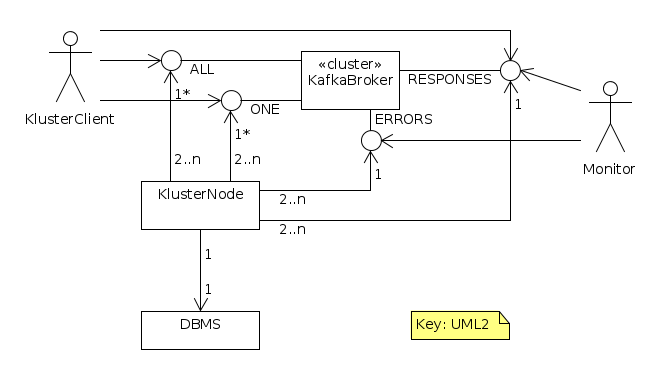

# Kluster

Cluster of N SQL-DBMS instances kept in sync __consistently__ using Kafka. So no need for eventual-consisteny! The price for
the consistenty is some limitations:
- Asynchronicity.
- The primary and foreign keys (PKs and FKs) should always be generated by the client (eg. using UUID) to ensure the 
  keys are identical on all nodes. This is needed ao. for joins to work on all nodes.
- For the same reason timestamps should be generated by the client, or the wrapping Kafka message timestamp should be
  used.   

You can use any type of DBMS (PostgreSQL, Oracle, MariaDB, etc.). In fact one could even mix them in the same cluster, provided they speak the same SQL dialect:
some nodes are PostgreSQL, some are Oracle, etc. If they dont speak the same SQL dialect the database adapters should do some translations.
However, for now mixing database types is not supported. 

Traditionally DBMSes support clustering each in their own way. They use master-slave nodes, active-active or active-passive modes, etc.
All these approaches are different for each DBMS vendor. Kluster provides a way to cluster a set of DBMS nodes of in a
vendor independant way.


## Design

Overview:  


Example with 3 nodes:  


Components:  


ALL topic:
- abbreviation for request_to_ALL_nodes topic 
- 1 partition, each node in its own consumer group, so *all* receive these messages 
- for CRUD messages
- response is written to RESPONSES
- messages are processed serial: they are processed in the given order

ONE topic:
- abbreviation for request_to_ONE_node topic 
- M >= 1 partitions, all nodes in the same consumer group, so only *one* node receives each message. 
- for R messages only 
- response is written to RESPONSES
- messages are processed in parallel 

RESPONSES topic:
- receives N responses per prequest to ALL
- receives just 1 response per request to ONE

ERRORS topic:
- nodes can send system errors to this topic

Client writes its request to ALL or ONE, and reads responses from RESPONSES:
- All CUD requests must go to ALL.
- R request can go to ALL: slow but __consistent__ response, will yield N responses, the first one is usually all you need.
- R request can go to ONE: fast but __eventually consistent__ response, will yield 1 response.    

Each node continuously reads request messages from the ALL and ONE topic asynchronously. Each messages is handed like this:
```
FOR EACH (request) {
    processed = false
    WHILE (!processed) {
        TRY {
            result = execute(request)
            commitTopicOffset()
            produceToResponseTopic(createResponse(request, result))
        } CATCH (transientException) {
            logError(transientException)
        } CATCH (exception) {
            produceToResponseTopic(createErrorResponse(request, exception))
            processed = true
        } CATCH (error) {
            produceToErrorTopic(createErrorResponse(request, error))
            processed = true
            THROW error            
        }
    }
}
```

### Monitoring

- Repeated transientErrors can be monitored by inspecting the ALL responses on RESPONSES: when for a while no responses have been received 
  from a node, while the others do send responses, something is wrong with that node.
- A node can report system errors on the ERRORS.  
qqqq upd diagram: rename Admin to Monitor, Monitor ook daar naar RESPONSES, rename RESPONSE to RESPONSES, idem ERRORS

### Replication

All nodes read from the ALL topic, so each processes all CRUD requests in given order.

NB. Kafka is clustered also, with multiple replicated instances for each partition.

### Load Balancing

Topic:
- ALL: No load balancing.
- ONE: Requests are distributed over all nodes. But this topic is for R requests only, so load balancing
  for those type of requests only. However, those are usually the requests thta cause the highest performance load.  

### Consistency

The client can wait for the first (or all when it was a request to ALL) response on RESPONSES topic to see if the result
indicates success or error.

### Backup

- Select a node.
- Stop it nicely, both consumers commit their current offset. Log the ALL offset.
- Create a snapshot backup of its database.
- Restart consumer, the consumers should each start stored offset.

### Recovery

A node had crashed and has been repaired, but its database is still empty. To bring it up again:

- First use the latest database backup to populate it.
- Next set the ALL topic consumer offset to the point corresponding to the database backup (see above the loogged offset). 
- Set ONE topic consumer offset to the end.

### Messages

#### Request
```
messageId: unique message id, generated by client, eg. a UUID
clientId: unique per client
sqlString: SQL string to be executed
```

Examples:
```
{
  "messageId": "client1.req004",
  "clientId": "client1"
  "sqlString": "select p.firstName, p.lastName, a.street, a.city from Person p join Address a on p.addressId = a.id"
}

{
  "messageId": "client2.req021",
  "clientId": "client2"
  "sqlString": "insert into address (id, street, city) values ('053caa8f-952a-4a3f-8c5d-3eac6e40f133', 'Hoofdstraat', 'Leiden')" 
}
```

#### Response
```
messageId: unique message id, generated by node that handled the request, eg. a UUID
nodeId: unique per node
requestId: the messageId of the corresponding request
requestTopiC: ALL or ONE
resultCode: 'OK', anything else is an error code
result: set only when resultCode == 'OK', JSON string containing the result of the operartion, in case of a query quite large for contains the entire result set
```

Examples:
```
{
  "messageId": "node3.rsp007",
  "nodeId": "node3"
  "requestId": "client1.req004",
  "requestTopic": "ONE"
  "resultCode": "OK",
  "result": [
      {"p.firstName": "Jan", "p.lastName": "Klaassen", "a.street": "Hoofdstraat", "a.city": "Gent"},
      {"p.firstName": "Donald", "p.lastName": "Duck", "a.street": "Hoofdstraat", "a.city": "Duckstad"},
      {"p.firstName": "Oblix", "p.lastName": "de Gallier", "a.street": "Dorpstraat", "a.city": "Dorpje"}
  ]
}

{
  "messageId": "node2.rsp018",
  "nodeId": "node2"
  "requestId": "client2.req021",
  "requestTopic": "ALL"
  "resultCode": "ERR: duplicate key: address.id = '053caa8f-952a-4a3f-8c5d-3eac6e40f133'"
}
```

qqqq fork java for kluster-client and kluster-db-node (based in Spring-JDBC)

## Quickstart

 1. Compile the software and start a cluster. This is done using a Makefile and docker-compose.  
 
        make
 
 1. Run kluster-client-golang.go

        cd kluster-client-golang
        KAFKA_RESPONSE_TOPIC="kluster-mutation-response" KAFKA_BOOTSTRAP_SERVERS="localhost:9092" KAFKA_MUTATION_TOPIC="kluster-mutation-test" go run kluster-client-golang.go

 1. You should see something like 
 
        2017/10/28 13:34:32 [kafkaClient] sent query for execution with id 1509190472045: SELECT 2+2 as Count
        2017/10/28 13:34:32 [futureResult] Waiting sync for query 1509190472045 to return
        2017/10/28 13:34:32 [kafkaResultTracker] Received result message, key=1509190472045 val=Successfully executed query, rowsAffected=1 
        2017/10/28 13:34:32 [kafkaResultTracker] received result for query with id 1509190472045, completing result!
        2017/10/28 13:34:32 [kafkaResultTracker] Received result message, key=1509190472045 val=Successfully executed query, rowsAffected=1 
        2017/10/28 13:34:32 [kafkaResultTracker] received result for query with id 1509190472045, was query was already finished at 2017-10-28T13:34:32+02:00
        2017/10/28 13:34:32 [kafkaResultTracker] Received result message, key=1509190472045 val=Successfully executed query, rowsAffected=1 
        2017/10/28 13:34:32 [kafkaResultTracker] received result for query with id 1509190472045, was query was already finished at 2017-10-28T13:34:32+02:00

### Manual steps
You can also spin up a cluster manually:

```sh
docker run --name kluster-kafka -d -p 2181:2181 -p 9092:9092 --env ADVERTISED_HOST=localhost --env ADVERTISED_PORT=9092 --env TOPICS=kluster-mutation,kluster-response spotify/kafka
            
docker run --name kluster-postgres-1 -d -p 20001:5432 -e POSTGRES_USER=kluster -e POSTGRES_PASSWORD=kluster -d postgres
docker run --name kluster-postgres-2 -d -p 20002:5432 -e POSTGRES_USER=kluster -e POSTGRES_PASSWORD=kluster -d postgres
docker run --name kluster-postgres-3 -d -p 20003:5432 -e POSTGRES_USER=kluster -e POSTGRES_PASSWORD=kluster -d postgres

# start the adapters (see kluster/docker-compose.yml for config) 
# start the golang
```

All writes are published as queries on a Kafka topic with one partition. 
Daemons read from this topic, execute the queries and write the response to the
response topic, using a correlation ID provided.

TODO:

 - [X] create a postgres adapter that listens on a kafka topic for queries
 - [X] provide docker compose file that spins it all up.
 - [X] implement a client that listens on the response topic and requires at least 1 result.
 - [ ] marshall the result set as part of the response
 - [ ] read queries should be handled by only one pg instance
 - [ ] allow messages to be a set of statements forming a transaction
 - [ ] analyse the consequences of allowing multiple write partitions, but force each producer to produce to the same partition during it's runtime.
 - [ ] implement a JDBC driver 
 - [ ] implement a golang SQL driver
 